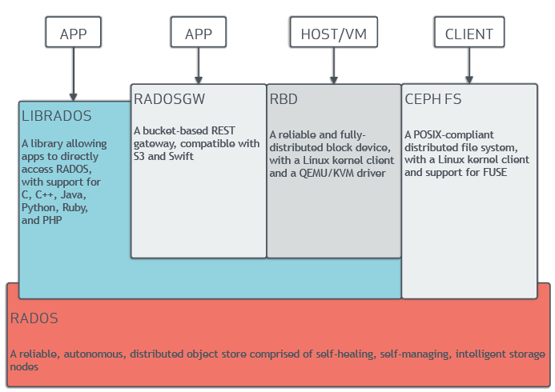

# Usefull Ceph commands

Hints and tips for Ceph

## Terminology

- RADOSGW - objects storage, bucket based REST gateways, compatible with S3 and swift
- RBD - block storage, block device with Linux kernel client and QEMU/KVM driver
- CEPH FS - distributed filesystem
- RADOS - reliable autonomous object store comprised of inteligent self-healing storage nodes

## Health and overview commands

`ceph -s` - see overall status of the cluster, number of OSDs, monitors etc

`ceph health detail` - good for checking which OSDs have problems

`ceph -w` - continuous display of what is happening inside cluster

`ceph auth ls` - list authorized clients

## monitors

## OSDs

- `ceph daemon osd.0 config show` - show active config

- `ceph daemon osd.0 config diff` - show difference between defaults and active config

- `ceph tell osd.0 injectargs --debug-osd 20 --debug-ms 1` - runtime changes to an daemon

- `ceph tell osd.* injectargs '--rbd_cache_max_dirty_age = 1'` - runtime change in all OSDs

## Pools

`ceph osd pool ls`

`ceph osd pool ls detail` - much better than previous one

`rados -p <poolname> ls` - pool info from rados point of view

`rbd -p glance ls` - list objects in a given pool

`rbd -p glance ls --long` - # list objects in a given pool, more details

`ceph osd pool create rbd1 <pgnum> <pgpnum> replicated` - create replicated pool

`ceph osd pool set {pool-name} pg_num {pg_num}` - set pgnum for existing pool, shoul dbe immediatelly followed by `ceph osd pool set {pool-name} pgp_num {pgp_num}`

## Crushmap

`ceph osd crush reweight <name> <number>` - reweight OSD

`ceph osd crush tree`

`ceph osd crush remove nodeX`

## PGs

`ceph pg dump` - dump info about **all** PGs onto screen, huge output

`ceph pg dump pgs_brief` - less clutter

`ceph pg dump osds` - more targetted, less clutter

`ceph pg dump pools` - more targetted, less clutter

`ceph pg ls stale/active/etc` - display PGs by state

`ceph pg dump_stuck inactive|unclean|stale`
  
- Inactive PGs cannot process reads or writes because they are waiting for an OSD with the most up-to-date data to come up and in.

- Unclean PGs contain objects that are not replicated the desired number of times. They should be recovering.

- Stale PGs are in an unknown state - the OSDs that host them have not reported to the monitor cluster in a while (configured by mon_osd_report_timeout).

`ceph pg {poolnum}.{pg-id} query` - very detailed info about single PG

`ceph pg map <pg>` - Ceph will return the placement group map, the placement group, and the OSD status

`ceph pg scrub {pg-id}` - scrub individual PG

`ceph pg {pg-id} mark_unfound_lost revert|delete` - mark the unfound objects as lost

## rados

`rados df` - show pool utilization stats, sizes etc, execute on monitor
`rados lspools` - show pool utilization stats, sizes etc, execute on monitor

## rgw

`radosgw-admin bucket stats` - list all buckets in radosgw

`radosgw-admin --id radosgw.gateway -k /etc/ceph/keyring.rados.gateway bucket stats 2>&1` - list of buckets and their properties
